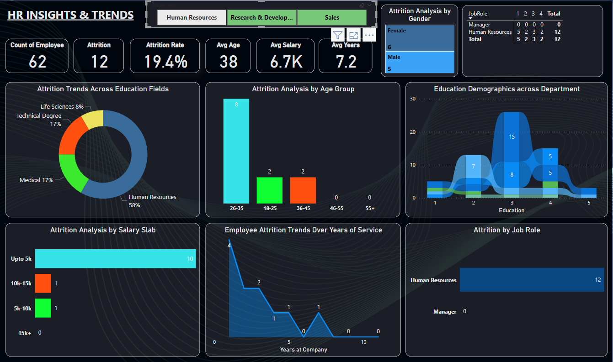
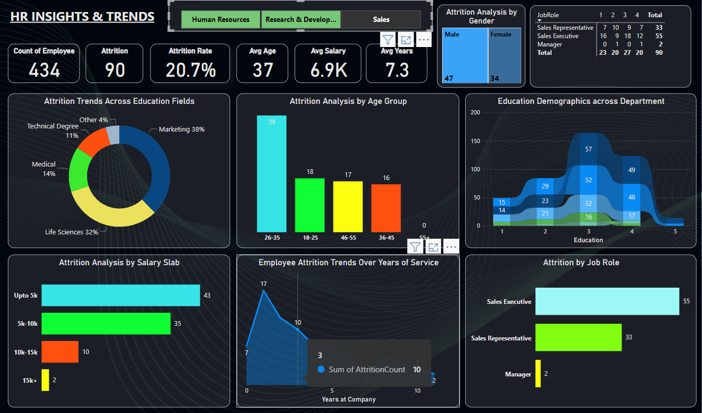

# 👥 HR Workforce Analysis Dashboard

An interactive **HR analytics dashboard** designed to provide insights into key workforce metrics, enabling data-driven decision-making in human resources management.

---

## 📌 About

The **HR Workforce Analysis Dashboard** leverages data visualization techniques to analyze and interpret organizational workforce data. It presents key metrics and trends in a visual and interactive format, allowing HR teams to make informed decisions about organizational growth, employee engagement, and performance.

Key objectives:

- Analyze employee demographics and departmental distribution  
- Monitor attrition and retention trends  
- Evaluate recruitment efficiency and hiring metrics  
- Track performance trends and engagement levels  
- Support data-driven HR strategy and planning  

---

## 🛠️ Tools & Technologies

- **Power BI** 
- **Data Preparation**: Power Query / SQL / Python (Pandas)  
- **Visualization**: KPI cards, bar/line charts, heatmaps, and interactive filters  

---


## ✨ Features

- 📊 **Employee Demographics** – Age, gender, tenure, and department distribution  
- 🧮 **Attrition Analysis** – Turnover rates, reasons for leaving, and retention strategies  
- 💼 **Recruitment Metrics** – Time-to-hire, cost-per-hire, and source effectiveness  
- 📈 **Performance Insights** – Employee performance trends and departmental evaluations  
- 🧠 **Engagement & Satisfaction** – Survey results and employee sentiment analysis  

---

## 📸 Dashboard Preview

| Dashboard | HR | R&D | Sales
|-----------------------|------------------|-------------------|-------------------|
|  |  |  |  |


---

## 🚀 Getting Started

1. **Clone the repository**  
   ```bash
   git clone https://github.com/Shivangkus/HR-Workforce-Analysis.git
   cd HR-Workforce-Analysis
